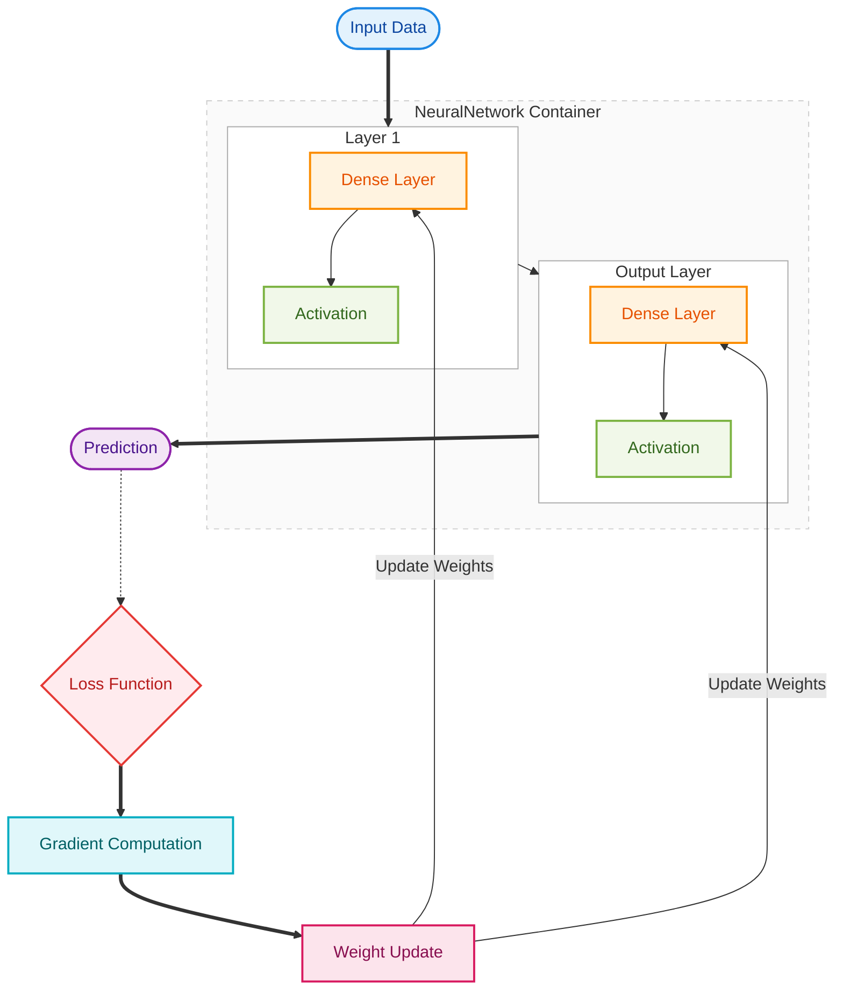
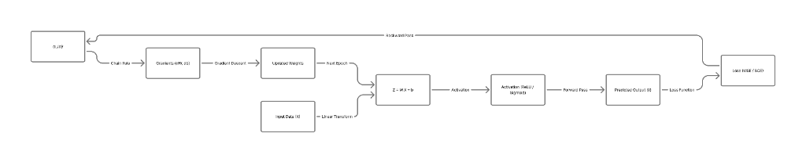
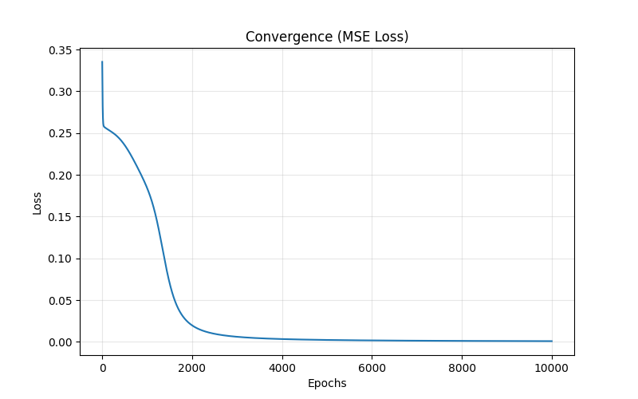
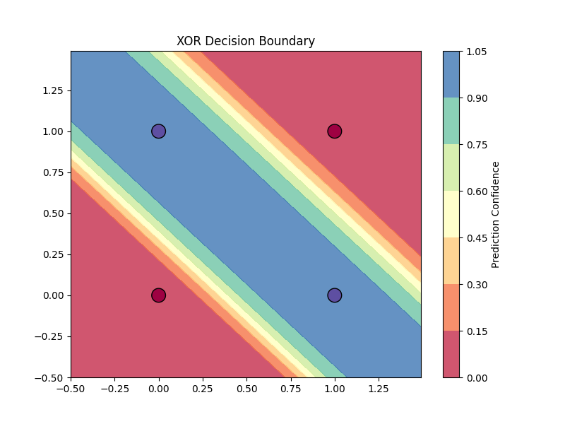
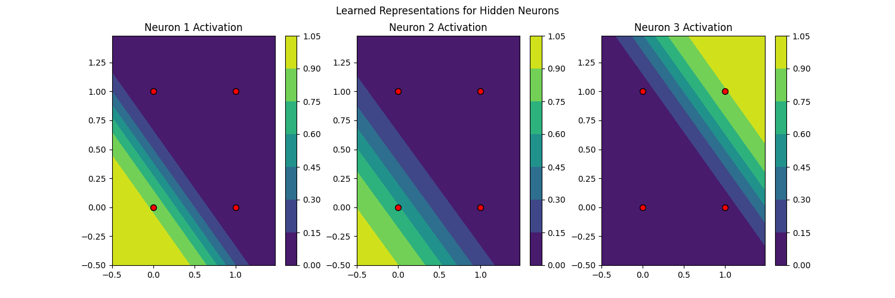
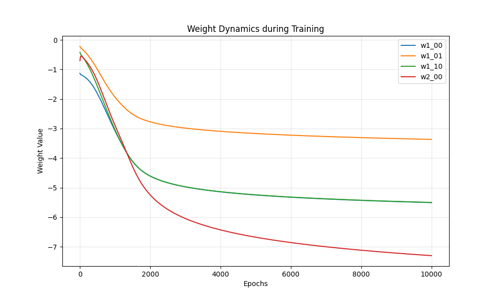

# Neural Network from Scratch: A First-Principles Implementation

[](https://opensource.org/licenses/MIT)
[](https://www.python.org/)
[](https://numpy.org/)
[](https://chandril-mallick-neural-foundations-app-kd133w.streamlit.app/)

A mathematically rigorous implementation of a Neural Network library built entirely from scratch using Python and NumPy. This project eschews high-level frameworks (PyTorch, TensorFlow) to demonstrate the fundamental calculus and linear algebra underlying deep learning.

##  Abstract

This library provides a modular, extensible architecture for building and training neural networks. By implementing forward pass, backpropagation, and optimization algorithms manually, this project serves as a concrete demonstration of:
- **Automatic Differentiation logic** (via manual chain rule derivation).
- **Gradient Descent dynamics** on non-convex loss surfaces.
- **Universal Approximation** capabilities of multi-layer perceptions (MLPs).

##  Neural Network Architecture & Data Flow

The following diagram illustrates the complete training pipeline of the neural network implemented from scratch. It shows how input data flows through linear transformations and activation functions, how loss is computed, and how gradients are propagated backward to update weights using gradient descent.



<p align="center">
  
</p>

##  Theoretical Formulation

The network computes a composite function $\Phi: \mathbb{R}^n \to \mathbb{R}^m$ through a sequence of affine transformations and non-linear activations.

### Forward Propagation
For a given layer $l$, the pre-activation $Z^{[l]}$ and activation $A^{[l]}$ are computed as:

$$Z^{[l]} = A^{[l-1]} \cdot W^{[l]} + b^{[l]}$$
$$A^{[l]} = \sigma(Z^{[l]})$$

Where $W^{[l]}$ is the weight matrix and $b^{[l]}$ is the bias vector initialized via **He Initialization** to maintain variance stability.

### Backpropagation (Gradient Flow)
Gradients are computed via the Chain Rule. The error signal $\delta^{[l]}$ propagates backward:

$$\delta^{[l]} = (\delta^{[l+1]} \cdot (W^{[l+1]})^T) \odot \sigma'(Z^{[l]})$$

Parameter updates follow the gradient of the Loss function $\mathcal{L}$ with respect to parameters:
$$\frac{\partial \mathcal{L}}{\partial W^{[l]}} = (A^{[l-1]})^T \cdot \delta^{[l]}$$

##  Visual Analysis

The following visualizations were generated directly from the model training process on the XOR dataset.

### 1. Convergence Analysis
The model minimizes Mean Squared Error (MSE) using Stochastic Gradient Descent.

<p align="center">
  
</p>

### 2. Decision Boundary
The XOR problem illustrates the necessity of hidden layers. A single linear decision boundary cannot separate the classes. The network learns a non-linear manifold that correctly isolates the `[0,1]` and `[1,0]` positive classes.

<p align="center">
  
</p>

### 3. Hidden Layer Representations
By visualizing the activation maps of the 3 hidden neurons, we can observe how the network decomposes the input space. Different neurons specialize in detecting different linear separabilities, which the output layer then recombines.

<p align="center">
  
</p>

### 4. Weight Dynamics
Tracing the trajectory of specific weights during training reveals the optimization landscape. We observe rapid initial adaptation followed by fine-tuning as the model settles into a local minimum.

<p align="center">
  
</p>

##  Architecture and Usage

### Project Structure
```bash
neural-network-from-scratch/
├── nn/
│   ├── layers.py       # Dense layers with He Init
│   ├── activations.py  # Sigmoid, ReLU
│   ├── loss.py         # MSE, Binary Cross Entropy
│   └── network.py      # Training engine
├── train.py            # Experiment runner
└── visualize_demo.py   # Visualization generator
```

### Quick Start
```python
from nn.network import NeuralNetwork
from nn.layers import Dense
from nn.activations import Sigmoid
from nn.loss import MSE

# Define Architecture
nn = NeuralNetwork(loss_function=MSE())
nn.add(Dense(input_size=2, output_size=3))
nn.add(Sigmoid())
nn.add(Dense(input_size=3, output_size=1))
nn.add(Sigmoid())

# Train
nn.train(X, y, epochs=10000, learning_rate=0.1)
```

##  Empirical Validation (XOR)

| Input | Target | Prediction | Error |
| :---: | :---: | :---: | :---: |
| `[0, 0]` | **0** | `0.057` | ~0.05 |
| `[0, 1]` | **1** | `0.932` | ~0.06 |
| `[1, 0]` | **1** | `0.913` | ~0.08 |
| `[1, 1]` | **0** | `0.082` | ~0.08 |

##  Future Work

- **Convolutional Layers**: Implementing `Conv2D` and `MaxPool` for image tasks.
- **Advanced Optimizers**: Adding `Adam` and `RMSProp`.
- **Softmax + Categorical Cross Entropy**: For multi-class classification.

---
**Author**: Chandril Mallick  

